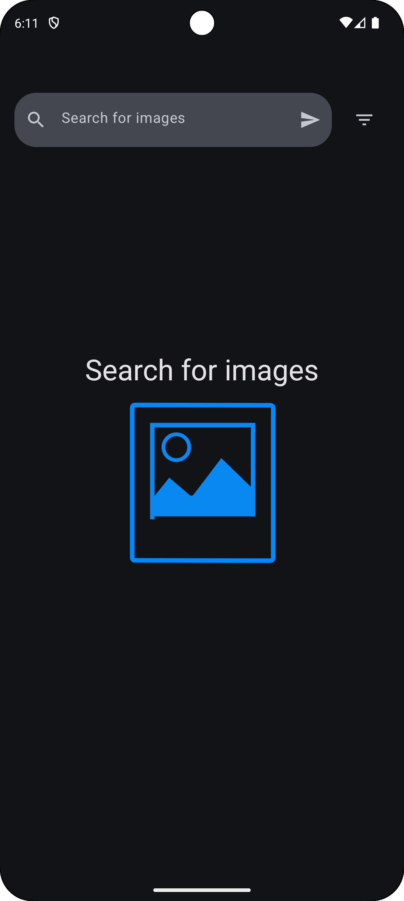
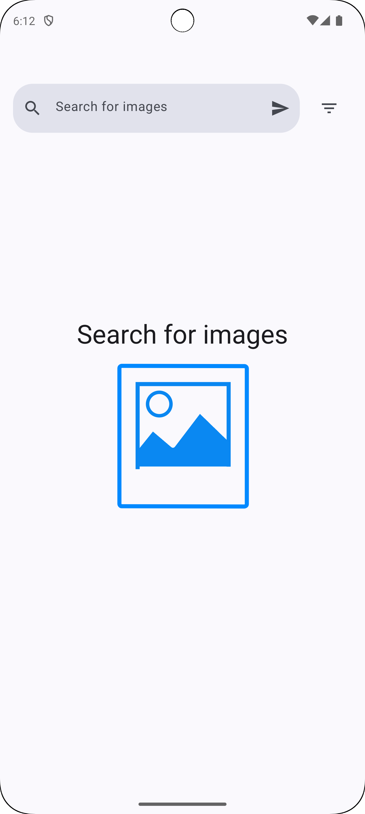
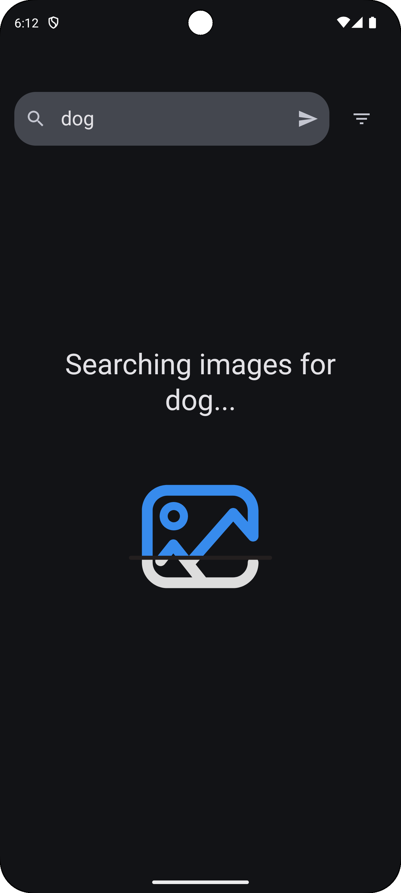
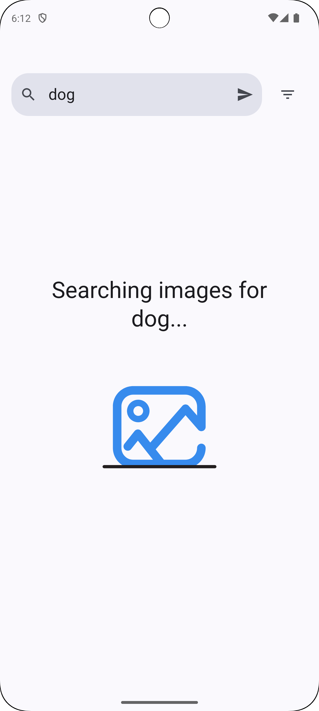
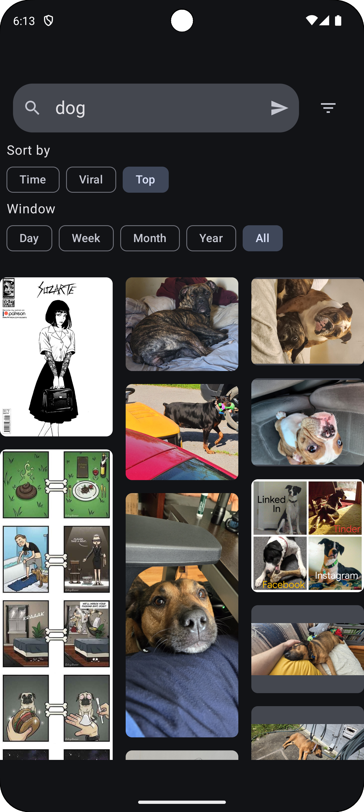
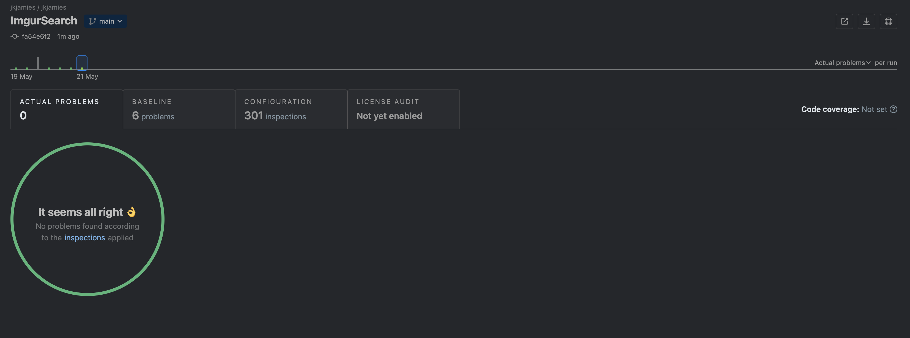

# Imgur Search Android Application

### Running Application

#### Unit Tests:

`./gradlew check`

#### UI Tests (omitted for time):

`./gradlew connectedAndroidTest`

#### Search Screen

| Dark Mode (Default)                         | Light Mode (Default)                            |
|---------------------------------------------|-------------------------------------------------|
|     |  |
| Dark Mode (Loading)                         | Light Mode (Loading)                            |
|  |     |
| Dark Mode (Filter & Results)                | Light Mode (Filter and Results)                 |
|   |      |

#### Details Screen

| Dark Mode                                  | Light Mode                                        |
|--------------------------------------------|---------------------------------------------------|
|  |  |

## Code Quality

### Project Results

## Improvement Ideas

- Table of single items in the SQLDelight DB rather than a list
- Use existing DB for filters for better performance
- Introduce concept of stale data to fetch remote data if local data is old
- Some empty files from "new project" were left, could clean up
- Address some TODO comments in the code representing better performance or ideas
- Add pagination for list of imgur images/gifs/videos
- Shared element transitions - click image and animate into full screen
- Accessibility enhancements
- Multiple languages
- Some error handling views for details screen
- Add more Unit tests
- Add UI tests
- Create documentation for implementation and architecture